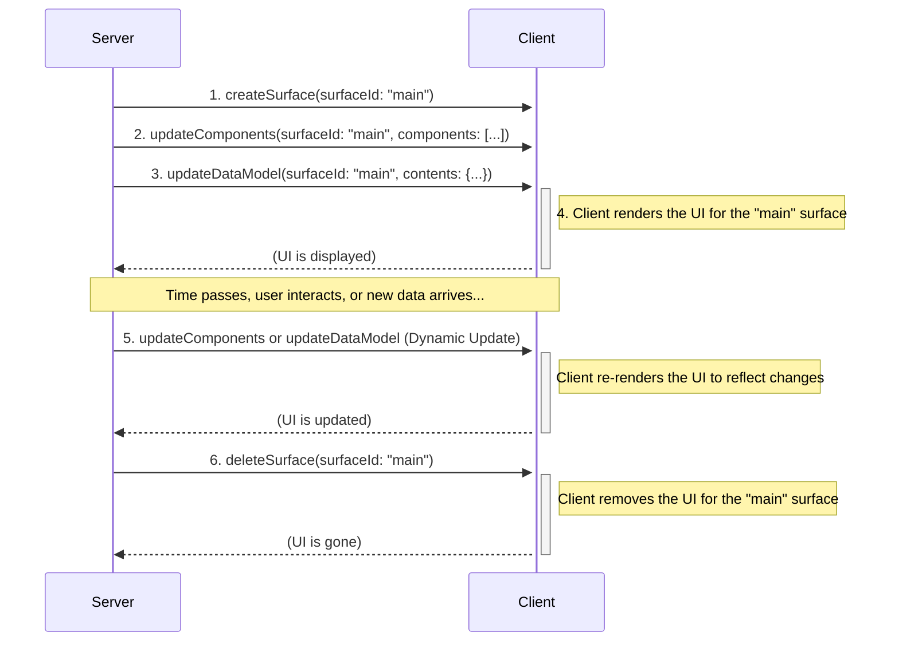
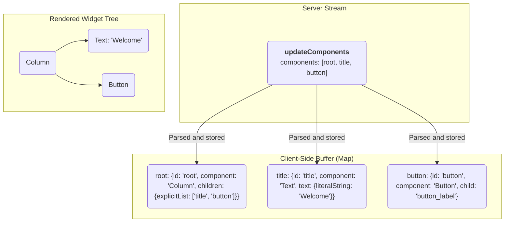

<!-- markdownlint-disable MD041 -->
<!-- markdownlint-disable MD033 -->
<div style="text-align: center;">
  <div class="centered-logo-text-group">
    
    <h1>A2UI (Agent to UI) Protocol v0.9</h1>
  </div>
</div>

A Specification for a JSON-Based, Streaming UI Protocol.

**Version:** 0.9
**Status:** Draft
**Created:** Nov 20, 2025
**Last Updated:** Dec 1, 2025

# A2UI (Agent to UI) Protocol v0.9

A Specification for a JSON-Based, Streaming UI Protocol

## Introduction

The A2UI Protocol is designed for dynamically rendering user interfaces from a stream of JSON objects sent from an A2A server. Its core philosophy emphasizes a clean separation of UI structure and application data, enabling progressive rendering as the client processes each message.

Communication occurs via a stream of JSON objects. The client parses each object as a distinct message and incrementally builds or updates the UI. The server-to-client protocol defines four message types:

- `createSurface`: Declares and configures a new UI area (a "surface") for rendering.
- `updateComponents`: Provides a list of component definitions to be added to or updated in a specific surface.
- `updateDataModel`: Provides new data to be inserted into or to replace a surface's data model.
- `deleteSurface`: Explicitly removes a surface and its contents from the UI.

## Changes from previous versions

Version 0.9 of the A2UI protocol represents a philosophical shift from previous versions. While v0.8 was optimized for LLMs that support structured output, v0.9 is designed to be embedded directly within a model's prompt. The LLM is then asked to produce JSON that matches the provided examples and schema descriptions.

This "prompt-first" approach offers several advantages:

1.  **Richer Schema:** The protocol is no longer limited by the constraints of structured output formats. This allows for more readable, complex, and expressive component catalogs.
2.  **Improved Generative Performance:** By providing the schema and examples in the prompt, the LLM has more context, leading to more relevant JSON generation.
3.  **Modularity:** The schema is now refactored into separate, more manageable components (e.g., [`common_types.json`], [`standard_catalog_definition.json`], [`server_to_client.json`]), improving maintainability and modularity.

The main disadvantage of this approach is that it requires more complex post-generation validation, as the LLM is not strictly constrained by the schema. This requires robust error handling and correction, so the system can identify discrepancies and attempt to fix them before rendering, or request a retry or correction from the LLM.

## Protocol Overview & Data Flow

The A2UI protocol uses a unidirectional stream of JSON messages from the server to the client to describe and update the UI. The client consumes this stream, builds the UI, and renders it. User interactions are handled separately, typically by sending events to a different endpoint, which may in turn trigger new messages on the UI stream.

Here is an example sequence of events (which don't have to be in exactly this order):

1.  **Create Surface:** The server sends a `createSurface` message to instruct the client to initialize a new, independent UI region.
2.  **Update Surface:** The server sends one or more `updateComponents` messages containing the definitions for all the components that will be part of the surface.
3.  **Update Data Model:** The server can send `updateDataModel` messages at any time to populate or change the data that the UI components will display.
4.  **Render:** The client renders the UI for the surface, using the component definitions to build the structure and the data model to populate the content.
5.  **Dynamic Updates:** As the user interacts with the application or as new information becomes available, the server can send additional `updateComponents` and `updateDataModel` messages to dynamically change the UI.
6.  **Delete Surface:** When a UI region is no longer needed, the server sends a `deleteSurface` message to remove it.



## The Protocol Schemas

A2UI v0.9 is defined by three interacting JSON schemas.

### Common Types

The [`common_types.json`] schema defines reusable primitives used throughout the protocol.

- **`stringOrPath` / `numberOrPath` / `booleanOrPath` / `stringArrayOrPath`**: The core of the data binding system. Any property that can be bound to data is defined as an object that accepts either a literal value OR a `path` string (JSON pointer).
- **`childrenProperty`**: Defines how containers hold children. It supports:

  - `explicitList`: A static array of component IDs.
  - `template`: A dynamic generator that creates children based on a list in the data model.

- **`id`**: The unique identifier for a component. Defined here so that all IDs are consistent and can be used for data binding.
- **`weight`**: The relative weight of a component within a Row or Column. This corresponds to the CSS 'flex-grow' property. Note: this may ONLY be set when the component is a direct descendant of a Row or Column. Defined here so that all weights are consistent and can be used for data binding.

### Server to Client Message Structure: The Envelope

The [`server_to_client.json`] schema is the top-level entry point. Every line streamed by the server must validate against this schema. It handles the message dispatching.

### The Standard Catalog

The [`standard_catalog_definition.json`] schema contains the definitions for all specific UI components (e.g., `Text`, `Button`, `Row`). By separating this from the envelope, developers can easily swap in custom catalogs (e.g., `material_catalog.json` or `cupertino_catalog.json`) without rewriting the core protocol parser.

Custom catalogs can be used to define additional UI components or modify the behavior of existing components. To use a custom catalog, simply include it in the prompt in place of the standard catalog. It should have the same form as the standard catalog, and use common elements in the [`common_types.json`] schema.

## Envelope Message Structure

The envelope defines four primary message types, and every message streamed by the server must be a JSON object containing exactly one of the following keys: `createSurface`, `updateComponents`, `updateDataModel`, or `deleteSurface`. The key indicates the type of message, and these are the messages that make up each message in the protocol stream.

### `createSurface`

This message instructs the client to initialize a new surface, which is a designated area for rendering a UI. This message must be sent before any `updateComponents`, `deleteSurface`, or `updateDataModel` messages that refer to the `surfaceId`.

**Properties:**

- `surfaceId` (string, required): A unique identifier for the UI surface to be rendered.
- `theme` (object, optional): Theming information for the UI, such as primary color.

**Example:**

```json
{
  "createSurface": {
    "surfaceId": "user_profile_card",
    "theme": {
      "primaryColor": "#007bff"
    }
  }
}
```

### `updateComponents`

This message provides a list of UI components to be added to or updated within a specific surface. The `surfaceId` must refer to a surface that has already been created with a `createSurface` message. The components are provided as a flat list, and their relationships are defined by ID references in an adjacency list.

**Properties:**

- `surfaceId` (string, required): The unique identifier for the UI surface to be updated. This is typically a name with meaning (e.g. "user_profile_card"), and it has to be unique within the context of the GenUI session.
- `components` (array, required): A list of component objects. The components are provided as a flat list, and their relationships are defined by ID references in an adjacency list.

**Example:**

```json
{
  "updateComponents": {
    "surfaceId": "user_profile_card",
    "components": [
      {
        "id": "root",
        "props": {
          "component": "Column",
          "children": { "explicitList": ["user_name", "user_title"] }
        }
      },
      {
        "id": "user_name",
        "props": {
          "component": "Text",
          "text": { "literalString": "John Doe" }
        }
      },
      {
        "id": "user_title",
        "props": {
          "component": "Text",
          "text": { "literalString": "Software Engineer" }
        }
      }
    ]
  }
}
```

### `updateDataModel`

This message is used to send or update the data that populates the UI components. The `surfaceId` must refer to a surface that has already been created with a `createSurface` message. It allows the server to change the UI's content without resending the entire component structure.

**Properties:**

- `surfaceId` (string, required): The unique identifier for the UI surface this data model update applies to.
- `path` (string, optional): A path to a specific location within the data model (e.g., `/user/name`). If omitted or set to `/`, the entire data model for the surface will be replaced.
- `contents` (object, required): The data to be updated in the data model. This can be any valid JSON object.

**Example:**

```json
{
  "updateDataModel": {
    "surfaceId": "user_profile_card",
    "path": "/user",
    "contents": {
      "name": "Jane Doe",
      "title": "Software Engineer"
    }
  }
}
```

### `deleteSurface`

This message instructs the client to remove a surface and all its associated components and data from the UI.

**Properties:**

- `surfaceId` (string, required): The unique identifier for the UI surface to be deleted.

**Example:**

```json
{
  "deleteSurface": {
    "surfaceId": "user_profile_card"
  }
}
```

## Example Stream

The following example demonstrates a complete interaction to render a Contact Form, expressed as a JSONL stream.

```jsonl
{"updateComponents":{"surfaceId":"contact_form_1","components":[{"id":"root","props":{"component":"Column","children":{"explicitList":["first_name_label","first_name_field","last_name_label","last_name_field","email_label","email_field","phone_label","phone_field","notes_label","notes_field","submit_button"]}}},{"id":"first_name_label","props":{"component":"Text","text":{"literalString":"First Name"}}},{"id":"first_name_field","props":{"component":"TextField","label":{"literalString":"First Name"},"text":{"path":"/contact/firstName"},"textFieldType":"shortText"}},{"id":"last_name_label","props":{"component":"Text","text":{"literalString":"Last Name"}}},{"id":"last_name_field","props":{"component":"TextField","label":{"literalString":"Last Name"},"text":{"path":"/contact/lastName"},"textFieldType":"shortText"}},{"id":"email_label","props":{"component":"Text","text":{"literalString":"Email"}}},{"id":"email_field","props":{"component":"TextField","label":{"literalString":"Email"},"text":{"path":"/contact/email"},"textFieldType":"shortText"}},{"id":"phone_label","props":{"component":"Text","text":{"literalString":"Phone"}}},{"id":"phone_field","props":{"component":"TextField","label":{"literalString":"Phone"},"text":{"path":"/contact/phone"},"textFieldType":"shortText"}},{"id":"notes_label","props":{"component":"Text","text":{"literalString":"Notes"}}},{"id":"notes_field","props":{"component":"TextField","label":{"literalString":"Notes"},"text":{"path":"/contact/notes"},"textFieldType":"longText"}},{"id":"submit_button_label","props":{"component":"Text","text":{"literalString":"Submit"}}},{"id":"submit_button","props":{"component":"Button","child":"submit_button_label","action":{"name":"submitContactForm"}}}]}}
{"updateDataModel": {"surfaceId": "contact_form_1", "path": "/contact", "contents": {"firstName": "John", "lastName": "Doe", "email": "john.doe@example.com"}}}
{"createSurface": {"surfaceId": "contact_form_1"}}
```

## Component Model

A2UI's component model is designed for flexibility, separating the protocol's structure from the set of available UI components.

### The Component Object

Each object in the `components` array of a `updateComponents` message defines a single UI component. It has the following structure:

- `id` (string, required): A unique string that identifies this specific component instance. This is used for parent-child references.
- `weight` (number, optional): The relative weight of this component within a `Row` or `Column`, corresponding to the CSS `flex-grow` property.
- `props` (object, required): An object containing the component-specific properties. This includes a `component` property that specifies the component's type (e.g., `"Text"`) and any other properties relevant to that component.

This structure is designed to be both flexible and strictly validated.

### The Component Catalog

The set of available UI components and their properties is defined in a **Component Catalog**. The standard catalog is defined in [`standard_catalog_definition.json`]. This allows for different clients to support different sets of components, including custom ones. The server must generate `updateComponents` messages that conform to the component catalog understood by the client.

### UI Composition: The Adjacency List Model

The A2UI protocol defines the UI as a flat list of components. The tree structure is built implicitly using ID references. This is known as an adjacency list model.

Container components (like `Row`, `Column`, `List`, and `Card`) have properties that reference the `id` of their child component(s). The client is responsible for storing all components in a map (e.g., `Map<String, Component>`) and recreating the tree structure at render time.

This model allows the server to send component definitions in any order, as long as all necessary components are present before rendering is triggered.

There must be exactly one component with the ID `root` in the component tree, acting as the root of the component tree. Until that component is defined, other component updates will have no visible effect, and they will be buffered until a root component is defined. Once a root component is defined, the client is responsible for rendering the tree in the best way possible based on the available data, skipping invalid references.



## Standard Component Catalog

The [`standard_catalog_definition.json`] provides the baseline set of components.

| Component          | Description                                             |
| :----------------- | :------------------------------------------------------ |
| **Text**           | Displays text. Supports simple Markdown.                |
| **Image**          | Displays an image from a URL.                           |
| **Icon**           | Displays a system-provided icon from a predefined list. |
| **Video**          | Displays a video from a URL.                            |
| **AudioPlayer**    | A player for audio content from a URL.                  |
| **Row**            | A horizontal layout container.                          |
| **Column**         | A vertical layout container.                            |
| **List**           | A scrollable list of components.                        |
| **Card**           | A container with card-like styling.                     |
| **Tabs**           | A set of tabs, each with a title and child component.   |
| **Divider**        | A horizontal or vertical dividing line.                 |
| **Modal**          | A dialog that appears over the main content.            |
| **Button**         | A clickable button that dispatches an action.           |
| **CheckBox**       | A checkbox with a label and a boolean value.            |
| **TextField**      | A field for user text input.                            |
| **DateTimeInput**  | An input for date and/or time.                          |
| **MultipleChoice** | A component for selecting one or more options.          |
| **Slider**         | A slider for selecting a numeric value within a range.  |

### Data Binding

Components connect to the data model through data binding. Any component property that can be dynamic (like the `text` of a `Text` component) accepts an object that can specify either a literal value or a path to a value in the data model.

These properties use one of the `*OrPath` types defined in `common_types.json` (e.g., `stringOrPath`, `numberOrPath`).

- **Literal Value**: To provide a static value, use the `literal*` property (e.g., `literalString`).
- **Data Model Path**: To bind to a value in the data model, use the `path` property. The value of the path is a string that corresponds to a key in the `contents` of a `updateDataModel` message.

Paths are specified using [JSON Pointer] syntax.

For components that use `childrenProperty`'s templates, the paths are relative paths within each data item in the list. For other uses, the paths are absolute paths within the data model.

**Example of a `stringOrPath` object:**

```json
// Static value
"text": { "literalString": "Hello, World!" }

// Dynamic value bound to the data model
"text": { "path": "/user/name" }
```

## Usage Pattern: The Prompt-Generate-Validate Loop

The A2UI protocol is designed to be used in a three-step loop with a Large Language Model:

1.  **Prompt**: Construct a prompt for the LLM that includes:

    - The desired UI to be generated.
    - The A2UI JSON schema, including the component catalog.
    - Examples of valid A2UI JSON.

2.  **Generate**: Send the prompt to the LLM and receive the generated JSON output.

3.  **Validate**: Validate the generated JSON against the A2UI schema. If the JSON is valid, it can be sent to the client for rendering. If it is invalid, the errors can be reported back to the LLM in a subsequent prompt, allowing it to self-correct.

This loop allows for a high degree of flexibility and robustness, as the system can leverage the generative capabilities of the LLM while still enforcing the structural integrity of the UI protocol.

## Client-to-Server Messages

The protocol also defines messages that the client can send to the server, which are defined in the [`client_to_server.json`] schema. These are used for handling user interactions and reporting client-side information.

### `userAction`

This message is sent when the user interacts with a component that has an `action` defined, such as a `Button`.

**Properties:**

- `name` (string, required): The name of the action.
- `surfaceId` (string, required): The ID of the surface where the action originated.
- `sourceComponentId` (string, required): The ID of the component that triggered the action.
- `timestamp` (string, required): An ISO 8601 timestamp.
- `context` (object, required): A JSON object containing any context provided in the component's `action` property.

### `error`

This message is used to report a client-side error to the server.

[`standard_catalog_definition.json`]: ../json/standard_catalog_definition.json
[`common_types.json`]: ../json/common_types.json
[`server_to_client.json`]: ../json/server_to_client.json
[`client_to_server.json`]: ../json/client_to_server.json
[JSON Pointer]: https://datatracker.ietf.org/doc/html/rfc6901
